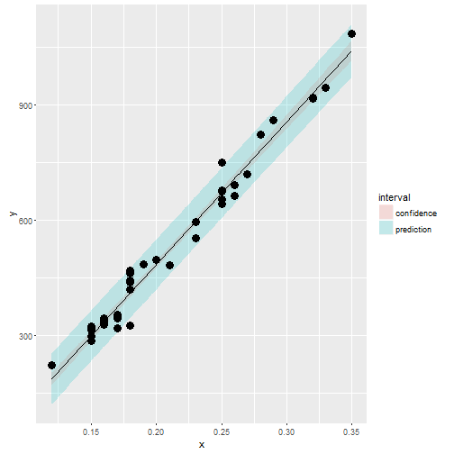

Shiny Carats Presentation
========================================================
author: Paul Hickman
date: June 2016
autosize: true

An explanation of how diamond buyers can check they are getting a good deal.

The Problem
========================================================

Diamond buyers need to negotiate price with sellers.  Experienced buyers are more able to negotiate better prices that newer buyers.  Using this system will level the playing field for buyers by using historical prices to predict current and future prices.

- Easy to use
- Predicts diamonds based on carat size
- Based on historical prices

Prediction
========================================================

The coefficients for the prediction of diamond price based on carat size is very good.


```r
library(UsingR); data(diamond)
y <- diamond$price; x <- diamond$carat;

fit <- lm(y ~ x);
summary(fit)$coefficients
```

```
             Estimate Std. Error   t value     Pr(>|t|)
(Intercept) -259.6259   17.31886 -14.99094 2.523271e-19
x           3721.0249   81.78588  45.49715 6.751260e-40
```

Confidence Intervals
========================================================

We are very confident in the regression line, so the interval is very narrow.



Summary
========================================================

- Fast and simple to use
- Highly accurate prediction
- Levels buyer experience
- Drive down price of diamonds
